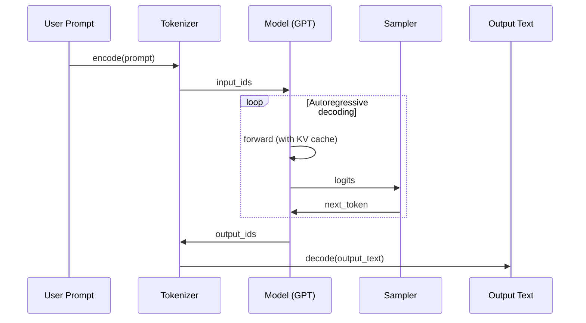

# 🧠 NanoInfer: Technical Design Document

> “From checkpoint to conversation — minimal, fast, and clear.”

---

## 1️⃣ 设计目标（Design Goals）

| 目标          | 说明                                   |
| ----------- | ------------------------------------ |
| 🧩 **轻量易读** | 1000 行内实现完整 LLM 推理流程（像 NanoGPT 一样）   |
| ⚙️ **工程可用** | 支持 batch、stream、cache、量化等核心推理能力      |
| 🔍 **教学透明** | 每个模块职责清晰，可追踪推理全过程                    |
| 🚀 **高性能**  | 支持 GPU 加速、KV Cache、Torch Compile     |
| 🌐 **易集成**  | 可嵌入任意 NanoChat / HuggingFace / 自定义模型 |
| 📊 **可评估**  | 提供标准化推理评测脚本与指标体系                     |

---

## 2️⃣ 总体架构（System Architecture）

```mermaid
graph TD
  A[🧠 模型权重<br/>sft_model.pt] -->|加载| B[Model Loader]
  B --> C[Inference Engine]
  C --> D[Tokenizer & Sampler]
  D --> E[Response Builder]
  E --> F[Evaluation Suite]
  E --> G[Serving Layer (FastAPI/Gradio)]
  C --> H[Optimization Plugins<br/> (FP16, KV Cache, Compile)]
```

---

### 模块说明

| 模块                       | 功能                                    | 核心文件                                   |
| ------------------------ | ------------------------------------- | -------------------------------------- |
| **Model Loader**         | 从权重加载 GPT 模型与配置                       | `model/loader.py`                      |
| **Inference Engine**     | 实现自回归生成循环，支持 KV 缓存与流式输出               | `engine/infer_engine.py`               |
| **Tokenizer & Sampler**  | 负责编码输入、解码输出、采样策略（Top-p / Temperature） | `tokenizer/tokenizer.py`, `sampler.py` |
| **Evaluation Suite**     | 自动运行 CORE / BLEU / PPL 任务             | `scripts/chat_eval_infer.py`           |
| **Serving Layer**        | 提供 HTTP / WebSocket API 服务            | `scripts/chat_server.py`               |
| **Optimization Plugins** | 提供半精度、编译优化、INT8/FP8、batch 推理等能力       | `plugins/optimize.py`                  |

---

## 3️⃣ 核心数据流（Inference Pipeline）



---

## 4️⃣ 核心模块设计

### 🧩 4.1 Model Loader

```python
# model/loader.py
import torch
from nanoinfer.model.gpt import GPT, GPTConfig

def load_model(checkpoint_path, device="cuda", dtype=torch.float16):
    ckpt = torch.load(checkpoint_path, map_location="cpu")
    config = GPTConfig.from_dict(ckpt["config"])
    model = GPT(config)
    model.load_state_dict(ckpt["model"])
    model.eval().to(device, dtype=dtype)
    return model
```

---

### ⚙️ 4.2 Inference Engine

```python
# engine/infer_engine.py
import torch
from nanoinfer.sampler import sample_next_token

def generate(model, input_ids, max_new_tokens=200, temperature=0.8, top_p=0.9):
    model.eval()
    past_key_values = None
    for _ in range(max_new_tokens):
        with torch.no_grad():
            logits, past_key_values = model(input_ids[:, -1:], use_cache=True, past_key_values=past_key_values)
            next_token = sample_next_token(logits, temperature, top_p)
            input_ids = torch.cat([input_ids, next_token], dim=-1)
    return input_ids
```

---

### 🧠 4.3 Tokenizer & Sampler

```python
# sampler.py
import torch

def sample_next_token(logits, temperature=0.8, top_p=0.9):
    logits = logits[:, -1, :] / temperature
    probs = torch.softmax(logits, dim=-1)
    sorted_probs, sorted_idx = torch.sort(probs, descending=True)
    cum_probs = torch.cumsum(sorted_probs, dim=-1)
    mask = cum_probs > top_p
    sorted_probs[mask] = 0
    sorted_probs /= sorted_probs.sum(dim=-1, keepdim=True)
    next_token = torch.multinomial(sorted_probs, num_samples=1)
    next_token = sorted_idx.gather(-1, next_token)
    return next_token
```

---

### 📊 4.4 Evaluation Suite

```bash
torchrun --standalone -m scripts.chat_eval_infer \
  --model=$MODEL_PATH \
  --eval_set=$NANOCHAT_BASE_DIR/eval_bundle/core_eval.json
```

指标：

* Perplexity (PPL)
* BLEU / ROUGE
* CORE reasoning tasks (问答逻辑)
* Token throughput / latency

---

### 🌐 4.5 Serving Layer

**HTTP 模式：**

```bash
python -m scripts.chat_server
```

FastAPI 伪代码：

```python
from fastapi import FastAPI
from nanoinfer.engine import generate
from nanoinfer.model.loader import load_model

app = FastAPI()
model = load_model("./models/sft_model.pt")

@app.post("/infer")
def infer(req: dict):
    prompt = req["prompt"]
    input_ids = tokenizer.encode(prompt, return_tensors="pt").cuda()
    output = generate(model, input_ids)
    return {"output": tokenizer.decode(output[0])}
```

---

## 5️⃣ 性能优化策略（Optimization Stack）

| 优化项                           | 方法                        | 效果        |
| ----------------------------- | ------------------------- | --------- |
| **KV Cache**                  | 避免重复前向计算                  | ⏱️ 2-4×加速 |
| **FP16 / BF16**               | 半精度推理                     | 显存减半      |
| **INT8 量化**                   | bitsandbytes / torch.int8 | 节省显存 3×   |
| **torch.compile()**           | 图优化                       | 吞吐提升 1.2× |
| **Batch Inference**           | 同时推理多个请求                  | GPU 利用率↑  |
| **CUDA Graphs**               | 稳定推理延迟                    | 推理抖动↓     |
| **Speculative Decoding (未来)** | 模型分层加速推理                  | 延迟下降 2×   |

---

## 6️⃣ 目录结构

```
nanoinfer/
├── engine/
│   ├── infer_engine.py
│   └── __init__.py
├── model/
│   ├── gpt.py
│   ├── loader.py
│   └── config.py
├── tokenizer/
│   └── tokenizer.py
├── plugins/
│   ├── optimize.py
│   └── quantize.py
├── scripts/
│   ├── chat_infer.py
│   ├── chat_eval_infer.py
│   ├── chat_server.py
│   └── benchmark.py
└── docs/
    └── inference_tutorial.md
```

---

## 7️⃣ 可扩展性（Extensibility）

| 方向        | 说明                                          |
| --------- | ------------------------------------------- |
| **多模型支持** | 兼容 HuggingFace、NanoChat、LLaMA 格式权重          |
| **多后端**   | 支持 PyTorch / vLLM / sglang / Triton Backend |
| **多设备**   | 自动选择 CUDA / ROCm / MPS / CPU                |
| **分布式推理** | 预留 Tensor Parallel 接口                       |
| **流式输出**  | 支持逐 token 流式返回（前端聊天场景）                      |

---

## 8️⃣ 技术栈

| 层级       | 技术                              |
| -------- | ------------------------------- |
| **核心框架** | PyTorch 2.1+                    |
| **加速**   | CUDA Graph, FP16, torch.compile |
| **量化**   | bitsandbytes / torch.int8       |
| **部署**   | FastAPI, Gradio, WebSocket      |
| **评估**   | rouge-score, nltk, datasets     |

---

## 9️⃣ 核心里程碑（Milestones）

| 阶段   | 内容                         | 目标完成时间   |
| ---- | -------------------------- | -------- |
| v0.1 | 单轮推理 + KV cache            | ✅ 基础可运行  |
| v0.2 | Batch + Eval metrics       | ✅ 教学可展示  |
| v0.3 | FastAPI 服务端                | 🚧 工程可部署 |
| v0.4 | torch.compile + FP16 优化    | 🚧 性能提升  |
| v0.5 | Streaming / WebSocket / UI | 📅 未来发布  |

---

## 🔚 10️⃣ 总结语

> **NanoInfer = NanoChat 的镜像面：**
>
> * NanoChat teaches you how to *train* a model.
> * NanoInfer teaches you how to *run* it.
>
> 一端是知识诞生，另一端是知识表达。
> 轻量、极简、透明 —— 这就是 NanoInfer 的全部哲学。
